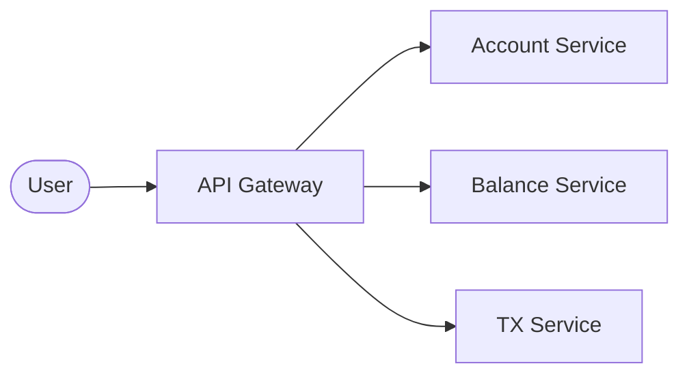
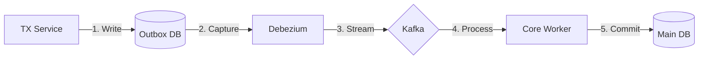
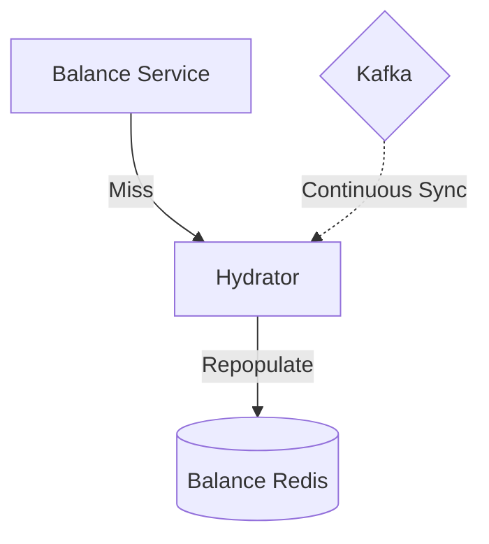
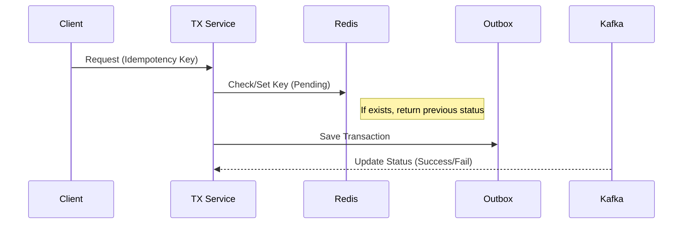
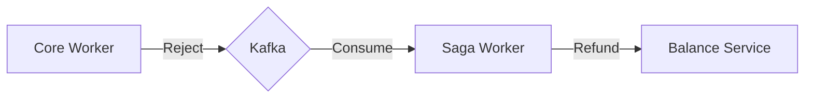
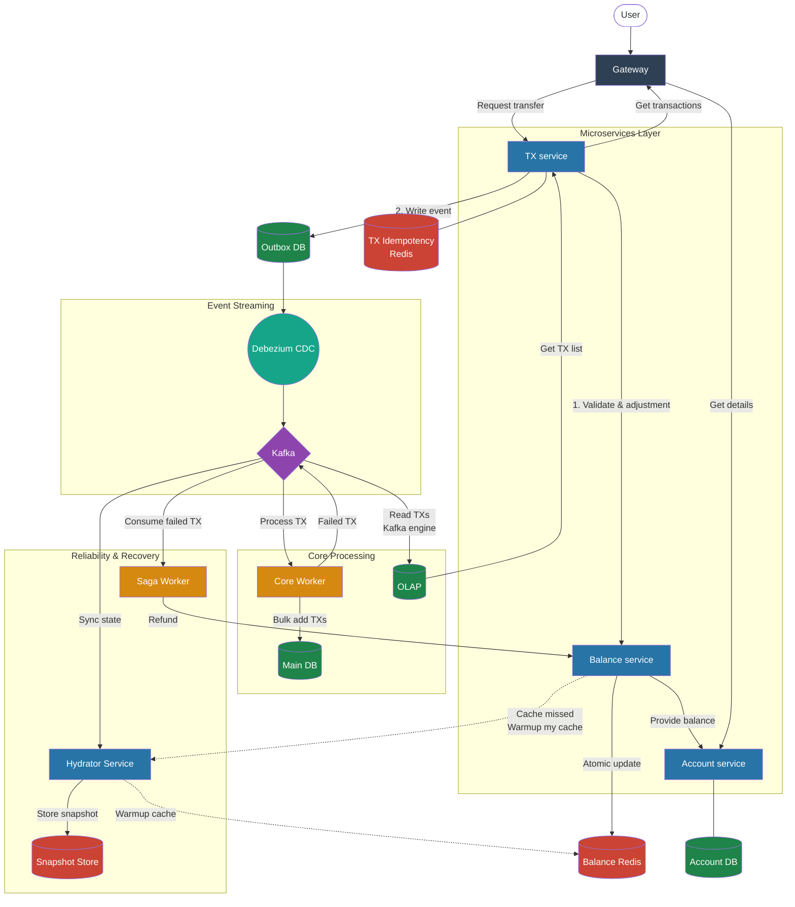
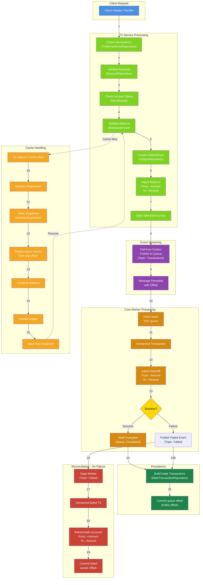

# Banking System

I’ve spent the last few days reading about challenges in the banking system. It’s clear that these systems need high availability and strict consistency to satisfy users.

Common issues include lack of reconciliation, double-spending, and bottlenecks in balance adjustments. While imagining a digital bank that could serve an entire country, I looked into architectures like the Digital Twin. I realized that most systems actually rely on eventual consistency, which seems to work well for them.

Of course, a system like this needs many different components working together to ensure it runs correctly with minimal downtime.

## Architecture

### Overview

I have implemented a robust, scalable architecture designed to address the challenges of a country-scale banking system.

#### System Components

The architecture consists of three client-facing microservices situated behind an **API Gateway**, which serves as the single entry point for all client requests.

1. **Account Service:** Manages user registration and account creation.
2. **Balance Service:** Provides real-time balance inquiries and validation.
3. **Transaction (TX) Service:** Orchestrates fund transfers.



#### Transaction Flow & Consistency

When a user initiates a transfer, the **TX Service** first queries the **Balance Service** to validate sufficient funds. Once validated, it requests a balance adjustment and records the transaction in its local database using the **Transactional Outbox Pattern**. A CDC (**Debezium**) monitors the outbox table and streams events to **Kafka**.

From there, a **Core Worker** consumes these events for processing. If the transaction meets all business rules, it is committed, and a success message is published. If a failure occurs, a "Failed Transaction" event is broadcast to the system.



### Addressing Edge Cases & Fault Tolerance

#### What if the Balance Service experiences a cache miss in Redis?

To ensure high performance, the **Balance Service** performs atomic adjustments within **Redis**. To handle potential cache misses, I have introduced a **Hydrator Service**.

The Hydrator maintains its own balance snapshot by consuming all transaction events from Kafka. If the Balance Service finds a key missing in Redis, it requests the state from the Hydrator, which repopulates the cache.



#### How are duplicate transactions (Double Spending) prevented?

The TX Service implements **Idempotency**. Every transaction request must include a unique **Idempotency Key**. Upon receipt, the service stores this key in Redis with a `PENDING` status. It then listens to Kafka for the final status (`SUCCESS`/`FAILED`) to update the record. This ensures that if a user retries the same request, the system can provide the current status rather than re-processing the transfer.



#### What happens if a transaction is invalidated by the Core Worker?

In scenarios where the Core Worker rejects a transaction (e.g., due to a blocked account status), it publishes a "Transaction Failed" event to Kafka. A dedicated **Saga Worker** (reconciliation) listens for these events and initiates a **Compensating Transaction** (refund) through the Balance Service to revert any temporary holds or adjustments, ensuring the system returns to a consistent state.



#### A user reports that their money was not transferred correctly (Observability).

This architecture uses **Kong** as the API Gateway to ensure that every request is assigned a unique **Request ID**. This ID is stored and propagated throughout the system, enabling effective log tracing and request tracking across services.
In addition, we use **Sentry** for real-time exception tracking and **Prometheus** for monitoring system health and consumer lag.

The system should log all events to provide full visibility into failures and help identify what happened during each incident.

### Notes

- To increase performance and reduce latency, we can implement an active-active (region-based) replication model for the core database; however, this will increase architectural complexity.
- To ensure high-performance retrieval of transaction history, I have applied the CQRS pattern, integrating an OLAP database for use by the TX service.
- Within this architecture, we can increase Kafka partition count and horizontally scale consumers/workers (and stateless services) to raise throughput and reduce processing latency. It just needs to add more detailed parameters to workers (e.g. regions).
- **The system should implement a circuit breaker mechanism to prevent cascading failures when critical components become unavailable.**

### Full System Diagram



## How To Run

### 1. Prepare the environment

Copy the example environment file and adjust values if needed.

```bash
cp .env.example .env
```

Example `.env`:

```env
APP_NAME="BankingSystem"
APP_ENV=dev
APP_DEBUG=true

DOC_AUTH_USERNAME=admin
DOC_AUTH_PASSWORD=123456

AUTH_JWT_SECRET=change_me
AUTH_ACCESS_TTL_MIN=60

TOPIC_TRANSACTIONS=prod.tx
TOPIC_FAILED=prod.failed

TREASURY_INITIAL_BALANCE=1000000
```

**Note**: `TREASURY_INITIAL_BALANCE` is the banking system’s initial treasury balance.

### 2. Install dependencies

```bash
make init
```

### 3. Run the application

```bash
make app
```

This command builds the application into `./build/app` and starts the HTTP server.

### 4. Run tests

Create a .env.testing file and run all tests:

```bash
cp .env.example .env
make test
```

Test command documentation:

```bash
make test:help
```

### 5. Swagger UI

After starting the application, the Swagger UI is available at:

```text
http://localhost:3000/docs
```

Swagger UI credentials are controlled with:

```env
DOC_AUTH_USERNAME=admin
DOC_AUTH_PASSWORD=123456
```

## Implementation

### Testing

This project needs increased test coverage, but in a real-world scenario, it would also require extensive integration and stress testing.

### Abstractions

| Interface                 | Purpose                                             |
| ------------------------- | --------------------------------------------------- |
| `AccountRepository`       | Account CRUD operations                             |
| `BalanceService`          | Balance queries and adjustments with cache handling |
| `TransferService`         | Fund transfer orchestration                         |
| `LedgerRepository`        | Redis-backed balance ledger                         |
| `OutboxRepository`        | Event outbox for CDC pattern                        |
| `OlapRepository`          | Transaction history queries (CQRS)                  |
| `HydratorService`         | Cache repopulation on misses                        |
| `TxIdempotencyRepository` | Idempotency key tracking                            |

### Core

| Implementation            | Location                                          | Details                                                   |
| ------------------------- | ------------------------------------------------- | --------------------------------------------------------- |
| `AccountService`          | `internal/service/account.go`                     | Creates accounts, validates balance, initiates transfers  |
| `BalanceService`          | `internal/service/balance.go`                     | Get/Adjust balance with automatic hydration on cache miss |
| `TransferService`         | `internal/service/transfer.go`                    | Validates funds, checks idempotency, writes outbox events |
| `Hydrator`                | `internal/service/hydrator.go`                    | Consumes Kafka events, maintains balance snapshots        |
| `LedgerRepository`        | `internal/datalayer/ledger_repository.go`         | Redis-backed atomic balance updates                       |
| `OutboxRepository`        | `internal/datalayer/outbox_repository.go`         | Persists events for CDC                                   |
| `OlapRepository`          | `internal/datalayer/olap_repository.go`           | Stores transactions for analytics                         |
| `TxIdempotencyRepository` | `internal/datalayer/tx_idempotency_repository.go` | Redis-backed idempotency key storage                      |
| `AccountRepository`       | `internal/datalayer/account_repository.go`        | Account persistence                                       |

### Transfer flow


