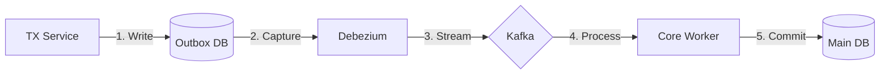
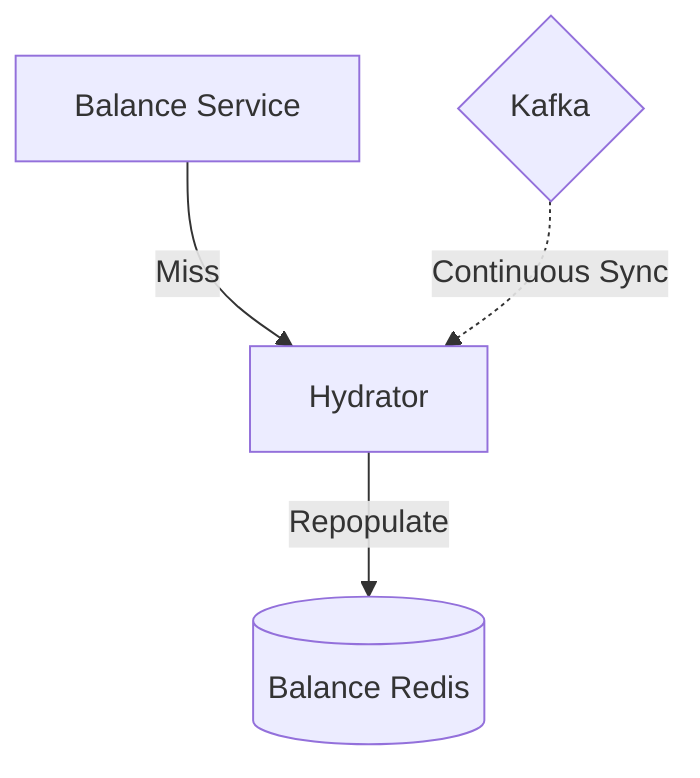
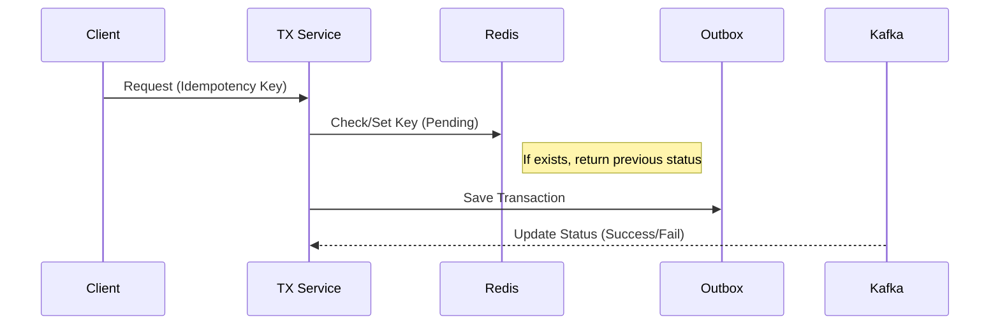
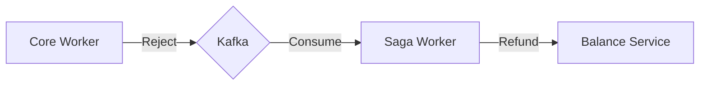
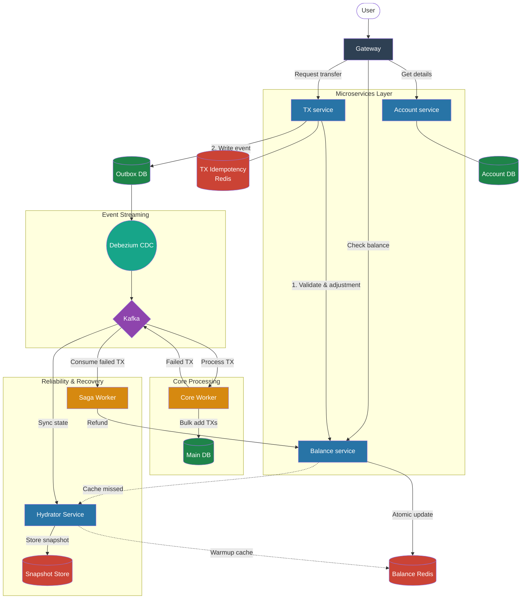

# Banking System

I’ve spent the last few days reading about challenges in the banking system. It’s clear that these systems need high availability and strong consistency to satisfy users.

Common issues include lack of reconciliation, double-spending, and bottlenecks in balance adjustments. While imagining a digital bank that could serve an entire country, I looked into architectures like the Digital Twin. I realized that most systems actually rely on eventual consistency, which seems to work well for them.

Of course, a system like this needs many different components working together to ensure it runs correctly with minimal downtime.

## Architecture

### Overview

I have implemented a robust, scalable architecture designed to address the challenges of a country-scale banking system.

#### System Components

The architecture consists of three client-facing microservices situated behind an **API Gateway**, which serves as the single entry point for all client requests.

1. **Account Service:** Manages user registration and account creation.
2. **Balance Service:** Provides real-time balance inquiries and validation.
3. **Transaction (TX) Service:** Orchestrates fund transfers.

#### Transaction Flow & Consistency

When a user initiates a transfer, the **TX Service** first queries the **Balance Service** to validate sufficient funds. Once validated, it requests a balance adjustment and records the transaction in its local database using the **Transactional Outbox Pattern**. A CDC (**Debezium**) monitors the outbox table and streams events to **Kafka**.

From there, a **Core Worker** consumes these events for processing. If the transaction meets all business rules, it is committed, and a success message is published. If a failure occurs, a "Failed Transaction" event is broadcast to the system.

### Addressing Edge Cases & Fault Tolerance

#### What if the Balance Service experiences a cache miss in Redis?

To ensure high performance, the **Balance Service** performs atomic adjustments within **Redis**. To handle potential cache misses, I have introduced a **Hydrator Service**.

The Hydrator maintains its own balance snapshot by consuming all transaction events from Kafka. If the Balance Service finds a key missing in Redis, it requests the state from the Hydrator, which repopulates the cache.

#### How are duplicate transactions (Double Spending) prevented?

The TX Service implements **Idempotency**. Every transaction request must include a unique **Idempotency Key**. Upon receipt, the service stores this key in Redis with a `PENDING` status. It then listens to Kafka for the final status (`SUCCESS`/`FAILED`) to update the record. This ensures that if a user retries the same request, the system can provide the current status rather than re-processing the transfer.

#### What happens if a transaction is invalidated by the Core Worker?

In scenarios where the Core Worker rejects a transaction (e.g., due to a blocked account status), it publishes a "Transaction Failed" event to Kafka. A dedicated **Saga Worker** (reconciliation) listens for these events and initiates a **Compensating Transaction** (refund) through the Balance Service to revert any temporary holds or adjustments, ensuring the system returns to a consistent state.

#### A user reports that their money was not transferred correctly.

This architecture uses **Kong** as the Gateway so that all requests have a unique **Request ID**. This ID is stored and propagated through the system, allowing us to trace logs effectively. Additionally, we use **Sentry** for real-time exception tracking and **Prometheus** for monitoring system health and consumer lag.

### Full System Diagram

