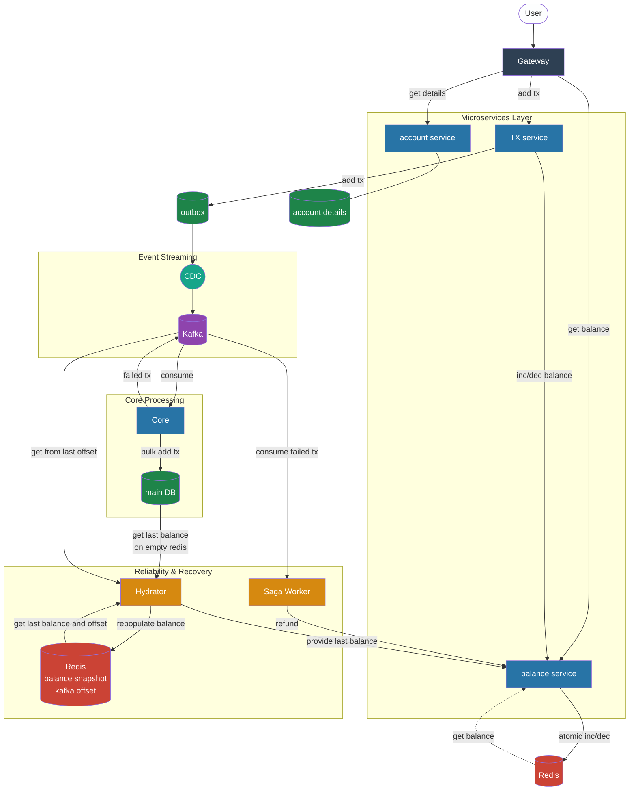

# Banking System

## Architecture

```mermaid
graph TD
    classDef actor fill:#fdfefe;
    classDef gateway fill:#2e4053,color:#fff;
    classDef service fill:#2874a6,color:#fff;
    classDef database fill:#1e8449,color:#fff;
    classDef queue fill:#8e44ad,color:#fff;
    classDef cache fill:#cb4335,color:#fff;
    classDef worker fill:#d68910,color:#fff;
    classDef cdc fill:#17a589,color:#fff;

    User([User]):::actor --> GW[Gateway]:::gateway

    subgraph Services [Microservices Layer]
        direction TB
        TX[TX service]:::service
        Bal[balance service]:::service
        Acc[account service]:::service
    end

    GW -->|add tx| TX
    GW -->|get balance| Bal
    GW -->|get details| Acc

    Acc --- AccDB[(account details)]:::database
    TX -->|add tx| Outbox[(outbox)]:::database
    TX -->|inc/dec balance| Bal

    Bal -->|atomic inc/dec| BalRedis[(Redis)]:::cache
    BalRedis -.->|get balance| Bal

    subgraph AsyncStreaming [Event Streaming]
        CDC((CDC)):::cdc
        Kafka[(Kafka)]:::queue
    end

    Outbox --> CDC
    CDC --> Kafka

    subgraph CoreSystem [Core Processing]
        Core[Core]:::service
        MainDB[(main DB)]:::database
    end

    Kafka -->|consume| Core
    Core -->|bulk add tx| MainDB
    Core -->|failed tx| Kafka

    subgraph Reliability [Reliability & Recovery]
        direction TB
        Rec[Saga Worker]:::worker
        Hyd[Hydrator]:::worker
        HydRedis[(Redis<br>balance snapshot<br>kafka offset)]:::cache
    end

    Kafka -->|consume failed tx| Rec
    Rec -->|refund| Bal

    HydRedis -->|get last balance and offset| Hyd
    MainDB -->|get last balance<br>on empty redis| Hyd
    Kafka -->|get from last offset| Hyd
    Hyd -->|repopulate balance| HydRedis
    Hyd -->|provide last balance| Bal
```
